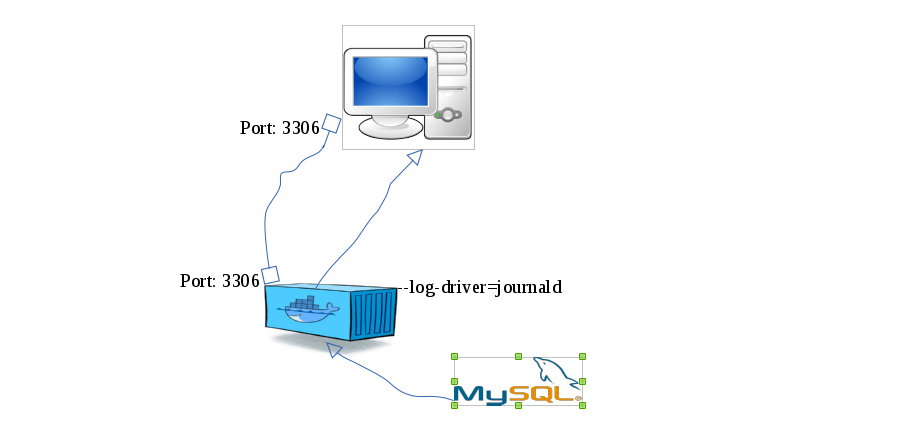

% Generació massiva de logs diversos
% Sunil Shrestha
% Maig 25, 2016

# Introducció

Tots els projectes necessitaran grans volums de logs, de tipus 
diferents, per posar a prova els seus sistemes. Aquest és un projecte 
al servei dels meus companys per facilitar la generació massiva de logs 
en els seus projectes.  

. . .
  
**Objectiu**: Generar logs diversos massivament.

# Les eines utilitzades

- Sistema operatiu **Fedora 20** 
- Bash  
- Python  
- Docker
- MySQL Server  

# Generar logs massivament 

. . . 

**Mètodes** 

- [Bash script](https://github.com/iamsunil/generate_logs/blob/master/metode1/logGenerator.sh)  
- [Systemd service](https://github.com/iamsunil/generate_logs/blob/master/metode2/README.md)  
- [Docker amb MySQL Server](https://github.com/iamsunil/generate_logs/blob/master/metode3/README.md)

# Funcionament del container

-----------

- Engegar en container amb aquest [script](../metode3/docker_mysql/start_cont.sh)
- MySQL Server escriurà els logs generat per aquest [script](../metode3/mysql_logGenerator.py) al  `/var/log/mysqlGeneral.log`.  
- filtrar els logs amb `journalctl` en el sistema.  

# Conclusions 

- Apendre nous conceptes 
- Funcionament `logs`, `syslog`, `journal` i `systemd` 
- Utilització de les eines i recursos apresos durant aquest curs.

# Opinió personal
- He aprés a treballar amb [github](https://github.com/alexsurfcasting/massivelogs)
- Saber actuar sol davant una situació concreta
- Conèixer noves eines com `pandoc`, `reveal.js` 

# Fi

Gràcies per la vostra atenció.

----------------

## Torn de preguntes

